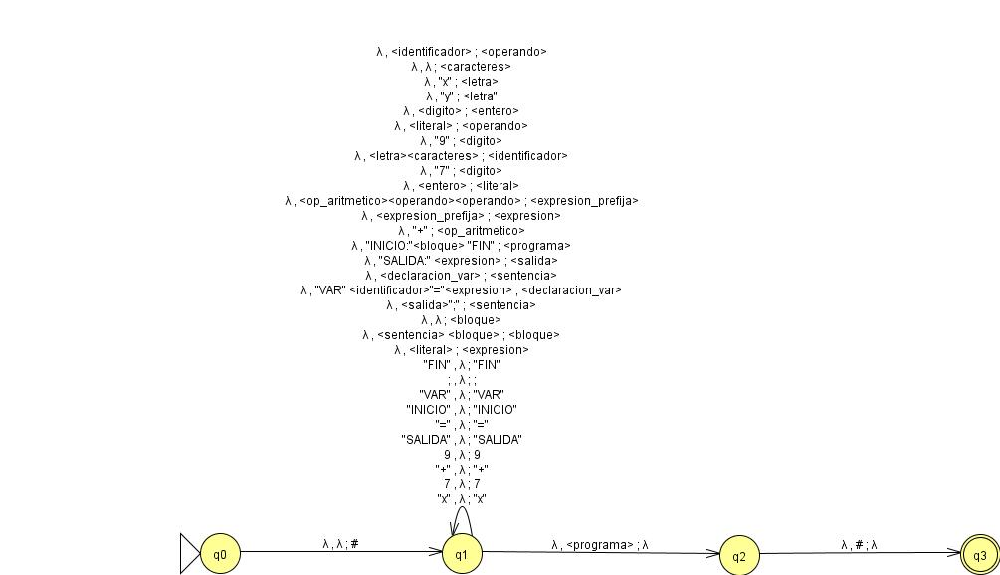

# Trabajos-Parseo

### TP1: Mapa conceptual


### TP2: Lenguaje a crear 

#### Objetivo
El lenguaje a desarrollar es un lenguaje de dominio específico procedural para la manipulación de **bases de datos**. Cuenta con soporte de estructuras de control (condicionales y bucles). Permite definir variables, tablas de datos y realiza también consultas básicas. Las operaciones aritméticas y lógicas se usan con notación polaca (prefija), y las palabras claves están en español.
#### Alcance
Su función es simular operaciones de SQL procedural en memoria y ejecutar consultas con expresiones booleanas y aritméticas en notación prefija.

No soporta joins complejos, subconsultas anidadas, recursión ni concurrencia. No interactúa con archivos ni bases de datos externas (datos en memoria únicamente)

#### Especificaciones léxicas
##### Palabras reservadas

Palabra |  Significado
--------|-------
INICIO:| Indica el inicio de un programa
FIN | Indica el fin de un programa
SALIDA:| Imprime una expresion númerica o booleana.
SI: | Inicia una estructura condicional (If)
ENTONCES:| Indica el inicio del bloque a ejecutar si la condición es VERDADERA
SINO:| Indica el bloque a ejecutar si la condición es FALSA
MIENTRAS:| Define la condición a cumplir para ejecutar un bucle (While)
HACER: | Indica el bloque de sentencias a ejecutar si la condición del bucle es verdadera
VAR | Inicia la declaración de una variable
TABLA | Indica que la variable declarada es una tabla

| Datos literales | Valor |
|-------------------|------ |
| ENTERO | combinaciones con los digitos 0-9 |
| BOOLEANO | "VERDADERO" o "FALSO" | 
| CADENA | secuencias de caracteres que inician con alguna letra y pueden contener guiones ("-" y "_") o digitos. |


#### Palabra reservadas operaciones procedurales

Palabra |  Significado
--------|-------
SELECCIONAR	| Inicia una consulta sobre una tabla declarada
DE | Indica la tabla fuente de la consulta
DONDE | Especifica una condición de filtrado (equivalente a WHERE)
AGRUPAR POR | Agrupa los resultados de la consulta según una o más columnas
ORDENAR POR | Ordena los resultados según una o más columnas

##### Identificadores

Los identificadores minimamente estan compuestos por una letra en minúscula (a-z), o mayúscula (A-Z) y pueden ser sucedidos por otra letra, un numero (0 - 9) o un guion bajo o medio (_/-). 

##### Operadores
|Tipo | Operador |
|-----|----------|
| Aritmetico | "+", "-", "/", "*", "%" |
| Logico | "&", "\|", "IGUALES" |
| Comparación | "==", "!=", ">", "<" | 
| Asignación | "=" |
| Negación | "!" | 
| Fin de sentencia | ";" |
##### Tipos de datos 
| Tipo | Valores |
------------------|--------------
| Booleano | "VERDADERO", "FALSO" |
|Entero | (0-9)+ |
|Cadena | Secuencias de caracteres entre comillas "..."|
| Tabla | conjunto de filas en memoria
#### Especificaciones sintácticas
[Notación EBNF del lenguaje](notacion_ebnf.md)

Regla | Especificación
-------------|------------
Estructura del programa | El programa siempre empieza con la palabra INICIO, seguida por un bloque de sentencias y finaliza con FIN.
Bloque | Está compuesto por cero o más sentencias
Sentencia | Puede ser la declaracion o asignación de una variable, una estructura condicional, un bucle o una salida por pantalla. Todas, menos las sentencias condicionales y los bucles, deben terminar con ";".
Declaración | Inicializa una variable iniciando con la palabra VAR y luego indicando su identificador y su valor inicial.
Asignación | Asigna un valor a una variable ya declarada, indicando su identificador seguido por "=" y su nuevo valor.
Salida | Imprime una expresion númerica o booleana.
Condicional | Estructura de control que selecciona un bloque dependiendo de una expresión booleana
Bucle | Ejecuta un bloque en caso de que una condición sea verdadera
Expresión | Operaciones o identificadores que reprensentan o producen valores numericos o booleanos.

#### Especificaciones semánticas

- **Declaraciones**: Cada variable debe ser declarada una única vez. Las variables definidas dentro del programa son de ámbito local, mientras que las definidas dentro de las estructuras condicionales o de bucle corresponden a un subambito y por lo tanto solamente pueden ser usadas dentro de esa estructura.
- **Asignaciones**: Deben realizarse sobre una variable existente con un identificador válido. El valor asignado tiene que ser del mismo tipo que la variable.
- **Operaciones**: todas las operaciones aritméticas o booleanas son realizadas con notación prefija, de forma que el operador precede a los operandos. 
     - **Aritméticas**: "+", "-", "*", "/", "%" solamente entre enteros.
     - **Comparaciones**: "==", "!=",">" y "<" solo entre enteros.
     - **Booleanas**: "&", "|", "!" solamente sobre valores booleanos.

- **Condicional**: las condiciones deben ser expresiones booleanas válidas. Todas las variables definidas previamente pueden ser usadas dentro del bloque de sentencias, mientras que las definidas dentro del bloque solamente pueden usarse dentro del mismo.
- **Bucle**: las condiciones deben ser expresiones booleanas válidas. Todas las variables definidas previamente pueden ser usadas dentro del bloque de sentencias, mientras que las definidas dentro del bloque solamente pueden usarse dentro del mismo.
- **Salida**: Solamente imprime expresiones válidas bien tipadas.
- **Errores**: en caso de no respetarse las especificaciones correspondietnes a cada caso, se debe lanzar un mensaje de error dando detalle para cada uno.
- **Consultas**: filtran datos en memoria según la expresión booleana en DONDE.


#### Ejemplo del lenguaje
```lisp
INICIO:

VAR TABLA empleados = [
	{ nombre: "Ana", edad: 30, salario: 2000, departamento: "Ventas" },
	{ nombre: "Luis", edad: 45, salario: 3000, departamento: "Ventas" },
	{ nombre: "Marta", edad: 29, salario: 2500, departamento: "IT" },
	{ nombre: "Pedro", edad: 35, salario: 2800, departamento: "IT" }
];

VAR bono = + 500 200;

bono = * bono 2;

SALIDA: bono;

SI: > bono 1000 ENTONCES:
	SALIDA: "Bono mayor a mil";
SINO:
	SALIDA: "Bono menor o igual a mil";

MIENTRAS: < bono 3000 HACER:
	bono = + bono 100;
	SALIDA: bono;

SALIDA: SELECCIONAR nombre, salario DE empleados DONDE > salario 2500;

SALIDA: SELECCIONAR departamento, salario DE empleados 
        AGRUPAR POR departamento;

FIN

```
### TP 3
#### Ejemplo de derivación por izquierda

```
INICIO: 
VAR x = 7; 
VAR y = 9; 
SALIDA: + x y; 
FIN
```

| **Cadena actual** | **Próxima producción a aplicar** |
|--------------------|----------------------------------|
| `<programa>` | `<programa> ::= "INICIO:" <bloque> "FIN"` |
| `INICIO: <bloque> FIN` | `<bloque> ::= <sentencia> <bloque>` | `λ `|
| `INICIO: <sentencia> <bloque> FIN` | `<sentencia> ::= <declaracion_var> ";"` |
| `INICIO: <declaracion_var> ; <bloque> FIN` | `<declaracion_var> ::= "VAR" <identificador> "=" <expresion>` |
| `INICIO: VAR <identificador> = <expresion> ; <bloque> FIN` | `<identificador> ::= <letra> <caracteres>` |
| `INICIO: VAR <letra> = <expresion> ; <bloque> FIN` | `<letra> ::= "x"` |
| `INICIO: VAR x = <expresion> ; <bloque> FIN` | `<expresion> ::= <literal>` |
| `INICIO: VAR x = <literal> ; <bloque> FIN` | `<literal> ::= <entero>` |
| `INICIO: VAR x = <entero> ; <bloque> FIN` | `<entero> ::= "7"` |
| `INICIO: VAR x = 7 ; <bloque> FIN` | `<bloque> ::= <sentencia> <bloque>` | `λ` |
| `INICIO: VAR x = 7 ; <sentencia> <bloque> FIN` | `<sentencia> ::= <declaracion_var> ";"` |
| `INICIO: VAR x = 7 ; <declaracion_var> ; <bloque> FIN` | `<declaracion_var> ::= "VAR" <identificador> "=" <expresion>` |
| `INICIO: VAR x = 7 ; VAR <identificador> = <expresion> ; <bloque> FIN` | `<identificador> ::= <letra> <caracteres>` |
| `INICIO: VAR x = 7 ; VAR <letra> = <expresion> ; <bloque> FIN` | `<letra> ::= "y"` |
| `INICIO: VAR x = 7 ; VAR y = <expresion> ; <bloque> FIN` | `<expresion> ::= <literal>` |
| `INICIO: VAR x = 7 ; VAR y = <literal> ; <bloque> FIN` | `<literal> ::= <entero>` |
| `INICIO: VAR x = 7 ; VAR y = <entero> ; <bloque> FIN` | `<entero> ::= "9"` |
| `INICIO: VAR x = 7 ; VAR y = 9 ; <bloque> FIN` | `<bloque> ::= <sentencia> <bloque>` | λ` |
| `INICIO: VAR x = 7 ; VAR y = 9 ; <sentencia> <bloque> FIN` | `<sentencia> ::= <salida> ";"` |
| `INICIO: VAR x = 7 ; VAR y = 9 ; <salida> ; <bloque> FIN` | `<salida> ::= "SALIDA:" <expresion>` |
| `INICIO: VAR x = 7 ; VAR y = 9 ; SALIDA: <expresion> ; <bloque> FIN` | `<expresion> ::= <expresion_prefija>` |
| `INICIO: VAR x = 7 ; VAR y = 9 ; SALIDA: <expresion_prefija> ; <bloque> FIN` | `<expresion_prefija> ::= <op_aritmetico> <operando> <operando>` |
| `INICIO: VAR x = 7 ; VAR y = 9 ; SALIDA: <op_aritmetico> <operando> <operando> ; <bloque> FIN` | `<op_aritmetico> ::= "+"` |
| `INICIO: VAR x = 7 ; VAR y = 9 ; SALIDA: + <operando> <operando> ; <bloque> FIN` | `<operando> ::= <identificador>` |
| `INICIO: VAR x = 7 ; VAR y = 9 ; SALIDA: + <identificador> <operando> ; <bloque> FIN` | `<identificador> ::= <letra> <caracteres>` |
| `INICIO: VAR x = 7 ; VAR y = 9 ; SALIDA: + <letra> <operando> ; <bloque> FIN` | `<letra> ::= "x"` |
| `INICIO: VAR x = 7 ; VAR y = 9 ; SALIDA: + x <operando> ; <bloque> FIN` | `<operando> ::= <identificador>` |
| `INICIO: VAR x = 7 ; VAR y = 9 ; SALIDA: + x <identificador> ; <bloque> FIN` | `<identificador> ::= <letra> <caracteres>` |
| `INICIO: VAR x = 7 ; VAR y = 9 ; SALIDA: + x <letra> ; <bloque> FIN` | `<letra> ::= "y"` |
| `INICIO: VAR x = 7 ; VAR y = 9 ; SALIDA: + x y ; <bloque> FIN` | `<bloque> ::= λ` |
| `INICIO: VAR x = 7 ; VAR y = 9 ; SALIDA: + x y ; FIN` | **Aceptada** |


#### Ejemplo de derivacion por derecha
```
INICIO: 
VAR x = 7; 
VAR y = 9; 
SALIDA: + x y; 
FIN
```

| **Cadena actual** | **Próxima producción a aplicar** |
|--------------------|----------------------------------|
| `<programa>` | ` <programa> ::= "INICIO:" <bloque> "FIN" ` |
| `INICIO: <bloque> FIN` | ` <bloque> ::= <sentencia> <bloque>` | λ  |
| `INICIO: <sentencia> <bloque> FIN` | ` <bloque> ::= <sentencia> <bloque>` | λ |
| `INICIO: <sentencia> <sentencia> <bloque> FIN` | ` <bloque> ::= <sentencia> <bloque> ` | λ ` |
| `INICIO: <sentencia> <sentencia> <sentencia> <bloque> FIN` | ` <bloque> ::= λ ` |
| `INICIO: <sentencia> <sentencia> <sentencia> FIN` | ` <sentencia> ::= <salida> ";" ` |
| `INICIO: <sentencia> <sentencia> <salida> ; FIN` | ` <salida> ::= "SALIDA:" <expresion> ` |
| `INICIO: <sentencia> <sentencia> SALIDA: <expresion> ; FIN` | ` <expresion> ::= <expresion_prefija> ` |
| `INICIO: <sentencia> <sentencia> SALIDA: <expresion_prefija> ; FIN` | ` <expresion_prefija> ::= <op_aritmetico> <operando> <operando> ` |
| `INICIO: <sentencia> <sentencia> SALIDA: <op_aritmetico> <operando> <operando> ; FIN` | ` <op_aritmetico> ::= "+" ` |
| `INICIO: <sentencia> <sentencia> SALIDA: + <operando> <operando> ; FIN` | ` <operando> ::= <identificador> ` | `<literal>` | `<consulta>` | `<expresion_prefija> ` |
| `INICIO: <sentencia> <sentencia> SALIDA: + <operando> <identificador> ; FIN` | ` <identificador> ::= <letra> <caracteres> ` |
| `INICIO: <sentencia> <sentencia> SALIDA: + <operando> <letra> <caracteres> ; FIN` | ` <letra> ::= "y" ` |
| `INICIO: <sentencia> <sentencia> SALIDA: + <operando> y ; FIN` | ` <caracteres> ::= λ ` |
| `INICIO: <sentencia> <sentencia> SALIDA: + <operando> y ; FIN` | ` <operando> ::= <identificador> ` |
| `INICIO: <sentencia> <sentencia> SALIDA: + <identificador> y ; FIN` | ` <identificador> ::= <letra> <caracteres> ` |
| `INICIO: <sentencia> <sentencia> SALIDA: + <letra> <caracteres> y ; FIN` | ` <letra> ::= "x" ` |
| `INICIO: <sentencia> <sentencia> SALIDA: + x <caracteres> y ; FIN` | ` <caracteres> ::= λ ` |
| `INICIO: <sentencia> <sentencia> SALIDA: + x y ; FIN` | ` <sentencia> ::= <declaracion_var> ";" ` |
| `INICIO: <sentencia> <declaracion_var> ; SALIDA: + x y ; FIN` | ` <declaracion_var> ::= "VAR" <identificador> "=" <expresion> ` |
| `INICIO: <sentencia> VAR <identificador> = <expresion> ; SALIDA: + x y ; FIN` | ` <identificador> ::= <letra> <caracteres> ` |
| `INICIO: <sentencia> VAR <letra> <caracteres> = <expresion> ; SALIDA: + x y ; FIN` | ` <letra> ::= "y" ` |
| `INICIO: <sentencia> VAR y <caracteres> = <expresion> ; SALIDA: + x y ; FIN` | ` <caracteres> ::= λ ` |
| `INICIO: <sentencia> VAR y = <expresion> ; SALIDA: + x y ; FIN` | ` <expresion> ::= <literal> ` |
| `INICIO: <sentencia> VAR y = <literal> ; SALIDA: + x y ; FIN` | ` <literal> ::= <entero> ` |
| `INICIO: <sentencia> VAR y = <entero> ; SALIDA: + x y ; FIN` | ` <entero> ::= "9" ` |
| `INICIO: <sentencia> VAR y = 9 ; SALIDA: + x y ; FIN` | ` <sentencia> ::= <declaracion_var> ";" ` |
| `INICIO: <declaracion_var> ; VAR y = 9 ; SALIDA: + x y ; FIN` | ` <declaracion_var> ::= "VAR" <identificador> "=" <expresion> ` |
| `INICIO: VAR <identificador> = <expresion> ; VAR y = 9 ; SALIDA: + x y ; FIN` | ` <identificador> ::= <letra> <caracteres> ` |
| `INICIO: VAR <letra> <caracteres> = <expresion> ; VAR y = 9 ; SALIDA: + x y ; FIN` | ` <letra> ::= "x" ` |
| `INICIO: VAR x <caracteres> = <expresion> ; VAR y = 9 ; SALIDA: + x y ; FIN` | ` <caracteres> ::= λ ` |
| `INICIO: VAR x = <expresion> ; VAR y = 9 ; SALIDA: + x y ; FIN` | ` <expresion> ::= <literal> ` |
| `INICIO: VAR x = <literal> ; VAR y = 9 ; SALIDA: + x y ; FIN` | ` <literal> ::= <entero> ` |
| `INICIO: VAR x = <entero> ; VAR y = 9 ; SALIDA: + x y ; FIN` | ` <entero> ::= "7" ` |
| `INICIO: VAR x = 7 ; VAR y = 9 ; SALIDA: + x y ; FIN` | ` <bloque> ::= λ ` |
| `INICIO: VAR x = 7 ; VAR y = 9 ; SALIDA: + x y ; FIN` | **Aceptada** |


### TP4: Analisis Sintactico Descendente con retroceso (ASDB)
```
INICIO: 
VAR x = 7; 
VAR y = 9; 
SALIDA: + x y; 
FIN
```


| Pila | Entrada | Transición |
| -- | -- | -- |
| `λ` | `INICIO: VAR x = 7; VAR y = 9; SALIDA: + x y; FIN` | δ(q0, λ, λ) = (q1, #) |
| `#` | `INICIO: VAR x = 7; VAR y = 9; SALIDA: + x y; FIN` | δ(q1, λ, λ) = (q1, `<programa>`) |
| `#<programa>` | `INICIO: VAR x = 7; VAR y = 9; SALIDA: + x y; FIN` | δ(q2, λ, <programa>) = (q2, "INICIO:" `<bloque>` "FIN") |
| `#"FIN" <bloque> "INICIO:"` | `INICIO: VAR x = 7; VAR y = 9; SALIDA: + x y; FIN` | δ(q2, "INICIO:", "INICIO:") = (q2, λ) |
| `#"FIN" <bloque>` | `VAR x = 7; VAR y = 9; SALIDA: + x y; FIN` | δ(q2, λ, <bloque>) = (q2, `<sentencia>` `<bloque>`) |
| `#"FIN" <bloque><sentencia>` | `VAR x = 7; VAR y = 9; SALIDA: + x y; FIN` | δ(q2, λ, `<sentencia>`) = (q2, `<declaracion_var>`";") |
| `#"FIN"<bloque>";"<declaracion_var>` | `VAR x = 7; VAR y = 9; SALIDA: + x y; FIN` | δ(q2, λ, `<declaracion_var>`) = (q2, "VAR" `<identificador>` "=" `<expresion>`) |
| `#"FIN"<bloque>";"<expresion>"="<identificador>"VAR"` | `VAR x = 7; VAR y = 9; SALIDA: + x y; FIN` | δ(q2, "VAR", "VAR") = (q2, λ) |
| `#"FIN"<bloque>";"<expresion>"="<identificador>` | `x = 7; VAR y = 9; SALIDA: + x y; FIN` | δ(q2, λ, <identificador>) = (q2, `<letra>``<caracteres>`) |
| `#"FIN"<bloque>";"<expresion>"="<caracteres><letra>` | `x = 7; VAR y = 9; SALIDA: + x y; FIN` | δ(q2, λ, `<letra>`) = (q2, "x") |
| `#"FIN"<bloque>";"<expresion>"="<caracteres>"x"` | `x = 7; VAR y = 9; SALIDA: + x y; FIN` | δ(q2, "x", "x") = (q2, λ) |
| `#"FIN"<bloque>";"<expresion>"="<caracteres>` | `= 7; VAR y = 9; SALIDA: + x y; FIN` | δ(q2, λ, `<caracteres>`) = (q2, λ) |
| `#"FIN"<bloque>";"<expresion>"="` | `= 7; VAR y = 9; SALIDA: + x y; FIN` | δ(q2, "=", "=") = (q2, λ) |
| `#"FIN"<bloque>";"<expresion>` | `7; VAR y = 9; SALIDA: + x y; FIN` | δ(q2, λ, `<expresion>`) = (q2, `<literal>`) |
| `#"FIN"<bloque>";"<literal>` | `7; VAR y = 9; SALIDA: + x y; FIN` | δ(q2, λ, `<literal>`) = (q2, `<entero>`) |
| `#"FIN"<bloque>";"<entero>` | `7; VAR y = 9; SALIDA: + x y; FIN` | δ(q2, λ, `<entero>`) = (q2, "7") |
| `#"FIN"<bloque>";""7"` | `7; VAR y = 9; SALIDA: + x y; FIN` | δ(q2, "7", "7") = (q2, λ) |
| `#"FIN"<bloque>";"` | `; VAR y = 9; SALIDA: + x y; FIN` | δ(q2, ";", ";") = (q2, λ) |
| `#"FIN"<bloque>` | `VAR y = 9; SALIDA: + x y; FIN` | δ(q2, λ, `<bloque>`) = (q2, `<sentencia>` `<bloque>`) |
| `#"FIN"<bloque><sentencia>` | `VAR y = 9; SALIDA: + x y; FIN` | δ(q2, λ, `<sentencia>`) = (q2, `<declaracion_var>`";") |
| `#"FIN"<bloque>";"<declaracion_var>` | `VAR y = 9; SALIDA: + x y; FIN` | δ(q2, λ, `<declaracion_var>`) = (q2, "VAR" `<identificador>` "=" `<expresion>`) |
| `#"FIN"<bloque>";"<expresion>"="<identificador>"VAR"` | `VAR y = 9; SALIDA: + x y; FIN` | δ(q2, "VAR", "VAR") = (q2, λ) |
| `#"FIN"<bloque>";"<expresion>"="<identificador>` | `y = 9; SALIDA: + x y; FIN` | δ(q2, λ, `<identificador>`) = (q2, `<letra>``<caracteres>`) |
| `#"FIN"<bloque>";"<expresion>"="<caracteres><letra>` | `y = 9; SALIDA: + x y; FIN` | δ(q2, λ, `<letra>`) = (q2, "y") |
| `#"FIN"<bloque>";"<expresion>"="<caracteres>"y"` | `y = 9; SALIDA: + x y; FIN` | δ(q2, "y", "y") = (q2, λ) |
| `#"FIN"<bloque>";"<expresion>"="<caracteres>` | `= 9; SALIDA: + x y; FIN` | δ(q2, λ, `<caracteres>`) = (q2, λ) |
| `#"FIN"<bloque>";"<expresion>"="` | `= 9; SALIDA: + x y; FIN` | δ(q2, "=", "=") = (q2, λ) |
| `#"FIN"<bloque>";"<expresion>` | `= 9; SALIDA: + x y; FIN` | δ(q2, λ, `<expresion>`) = (q2, `<literal>`) |
| `#"FIN"<bloque>";"<literal>` | `9; SALIDA: + x y; FIN` | δ(q2, λ, `<literal>`) = (q2, `<entero>`) |
| `#"FIN"<bloque>";"<entero>` | `9; SALIDA: + x y; FIN` | δ(q2, λ, `<entero>`) = (q2, "9") |
| `#"FIN"<bloque>";""9"` | `9; SALIDA: + x y; FIN` | δ(q2, "9", "9") = (q2, λ) |
| `#"FIN"<bloque>";"` | `; SALIDA: + x y; FIN` | δ(q2, ";", ";") = (q2, λ) |
| `#"FIN"<bloque>` | `SALIDA: + x y; FIN` | δ(q2, λ, `<bloque>`) = (q2, `<sentencia>` `<bloque>`) |
| `#"FIN"<bloque><sentencia>` | `SALIDA: + x y; FIN` | δ(q2, λ, `<sentencia>`) = (q2, `<salida>`) |
| `#"FIN"<bloque><salida>` | `SALIDA: + x y; FIN` | δ(q2, λ, `<salida>`) = (q2, "SALIDA:" `<expresion>`) |
| `#"FIN"<bloque>";"<expresion>"SALIDA:"` | `SALIDA: + x y; FIN` | δ(q2, "SALIDA:", "SALIDA:") = (q2, λ) |
| `#"FIN"<bloque>";"<expresion>` | `+ x y; FIN` | δ(q2, λ, `<expresion>`) = (q2, `<expresion_prefija>`) |
| `#"FIN"<bloque>";"<expresion_prefija>` | `+ x y; FIN` | δ(q2, λ, `<expresion_prefija>`) = (q2, `<op_aritmetico>``<operando>``<operando>`) |
| `#"FIN"<bloque>";"<operando><operando><op_aritmetico>` | `+ x y; FIN` | δ(q2, λ, `<op_aritmetico>`) = (q2, "+") |
| `#"FIN"<bloque>";"<operando><operando>"+"` | `+ x y; FIN` | δ(q2, "+", "+") = (q2, λ) |
| `#"FIN"<bloque>";"<operando><operando>` | `x y; FIN` | δ(q2, λ, `<operando>`) = (q2, `<literal>`) |
| `#"FIN"<bloque>";"<operando><literal>` | `x y; FIN` | δ(q2, λ, `<literal>`) = (q2, `<identificador>`) |
| `#"FIN"<bloque>";"<operando><identificador>` | `x y; FIN` | δ(q2, λ, `<identificador>`) = (q2, `<letra>``<caracteres>`) |
| `#"FIN"<bloque>";"<operando><caracteres><letra>` | `x y; FIN` | δ(q2, λ, `<letra>`) = (q2, "x") |
| `#"FIN"<bloque>";"<operando><caracteres>"x"` | `x y; FIN` | δ(q2, "x", "x") = (q2, λ) |
| `#"FIN"<bloque>";"<operando><caracteres>` | `y; FIN` | δ(q2, λ, `<caracteres>`) = (q2, λ) |
| `#"FIN"<bloque>";"<operando>` | `y; FIN` | δ(q2, λ, `<operando>`) = (q2, `<literal>`) |
| `#"FIN"<bloque>";"<literal>` | `y; FIN` | δ(q2, λ, `<literal>`) = (q2, `<identificador>`) |
| `#"FIN"<bloque>";"<identificador>` | `y; FIN` | δ(q2, λ, `<identificador>`) = (q2, `<letra>``<caracteres>`) |
| `#"FIN"<bloque>";"<caracteres><letra>` | `y; FIN` | δ(q2, λ, `<letra>`) = (q2, "y") |
| `#"FIN"<bloque>";"<caracteres>"y"` | `y; FIN` | δ(q2, "y", "y") = (q2, λ) |
| `#"FIN"<bloque>";"<caracteres>` | `; FIN` | δ(q2, λ, `<caracteres>`) = (q2, λ) |
| `#"FIN"<bloque>";"` | `; FIN` | δ(q2, ";", ";") = (q2, λ) |
| `#"FIN"<bloque>` | `FIN` | δ(q2, λ, `<bloque>`) = (q2, λ) |
| `#"FIN"` | `FIN` | δ(q2, "FIN", "FIN") = (q2, λ) |
| `#` | `λ` | δ(q2, λ, #) = (q3, λ) |
| `λ` | `λ` | ACCEPT |

### TP5: Analisis sintactico descendente predictivo (LL(1))

Derivaciones usadas para el ejemplo:
```bnf
<programa> ::= "INICIO:" <bloque> "FIN"
<bloque> ::= <sentencia> <bloque> | λ
<sentencia> ::= <declaracion_var> ";" | <salida> ";"
<declaracion_var> ::= "VAR" <identificador> "=" <expresion>
<salida> ::= "SALIDA:" <expresion>
<expresion> ::= <literal> | <expresion_prefija>
<expresion_prefija> ::= <op_aritmetico> <operando> <operando>
<operando> ::= <identificador> | <literal>
<literal> ::= <entero>
<entero> ::= <digito>
<identificador> ::= <letra> <caracteres>
<caracteres> ::= λ
<letra> ::= "x" | "y"
<digito> ::= "7" | "9"
<op_aritmetico> ::= "+"
```
Primeros: 
> PRIM(<programa>) = {"INICIO:"}
>
> PRIM(<bloque>) = {"VAR", "SALIDA:",λ}
>
>PRIM(<sentencia>) = {"VAR", "SALIDA:"}
>
>PRIM(<declaracion_var>) = {"VAR"}
>
>PRIM(<salida>) = {"SALIDA:"}
>
>PRIM(<expresion>) = {"7", "9", "+"}
>
>PRIM(<expresion_prefija>) = {+}
>
>PRIM(<operando>) = {"x", "y", "7", "9"}
>
>PRIM(<literal>) = {"7", "9"}
>
>PRIM(<entero>) = {"7", "9"}
>
>PRIM(<identificador>) = {"x", "y"}
>
>PRIM(<caracteres>) = {λ}
>
>PRIM(<letra>) = {"x", "y"}
>
>PRIM(<digito>) = {"7", "9"}
>
>PRIM(<op_aritmetico>) = {"+"}

Siguientes: 

>SIG(<programa>) = {$}
>
>SIG(<bloque>) = {"FIN"}
>
>SIG(<sentencia>) = {"VAR", "SALIDA:", "FIN"}
>
>SIG(<declaracion_var>) = {";"}
>
>SIG(<salida>) = {";"}
>
>SIG(<expresion>) = {";"}
>
>SIG(<expresion_prefija>) = {";"} 
>
>SIG(<operando>) = {";", "x", "y", "7", "9"}
>
>SIG(<literal>) = {";", "x", "y", "7", "9"}
>
>SIG(<entero>) = {";", "x", "y", "7", "9"}
>
>SIG(<identificador>) = {"=", ";", "x", "y", "7", "9"}
>
>SIG(<caracteres>) = {"=", ";", "x", "y", "7", "9"}
>
>SIG(<letra>) = {"=", ";", "x", "y", "7", "9"}
>
>SIG(<digito>) =  {";", "x", "y", "7", "9"}
>
>SIG(<op_aritmetico>) = {"x", "y", "7", "9"}

Predicciones:

>PRED(<programa> ::= "INICIO:" <bloque> "FIN") = { "INICIO:" }
>
>PRED(<bloque>) = ( PRED(<bloque> ::= <sentencia> <bloque>) = { "VAR", "SALIDA:" } U PRED(<bloque> ::= λ) = { "FIN" } ) => PRED(<bloque>) = { "VAR", "SALIDA:","FIN" }
>
>PRED(<sentencia>) = ( PRED(<sentencia> ::= <declaracion_var> ";") = { "VAR" }U PRED(<sentencia> ::= <salida> ";") = { "SALIDA:" } )=> PRED(<sentencia>) = { "VAR", "SALIDA:" }
>
>PRED(<declaracion_var> ::= "VAR" <identificador> "=" <expresion>) = { "VAR" }
>
>PRED(<salida> ::= "SALIDA:" <expresion>) = { "SALIDA:" }
>
>PRED(<expresion>) = ( PRED(<expresion> ::= <literal>) = { "7", "9" } U PRED(<expresion> ::= <expresion_prefija>) = { "+" } ) => PRED(<expresion>) = { "7", "9", "+" }
>
>PRED(<expresion_prefija> ::= <op_aritmetico> <operando> <operando>) = { "+" }
>
>PRED(<operando>) = ( PRED(<operando> ::= <identificador>) = { "x", "y" } U PRED(<operando> ::= <literal>) = { "7", "9" } ) => PRED(<operando>) = { "x", "y", "7", "9" }
>
>PRED(<literal> ::= <entero>) = { "7", "9" }
>
>PRED(<entero> ::= <digito>) = { "7", "9" }
>
>PRED(<identificador> ::= <letra> <caracteres>) = { "x", "y" }
>
>PRED(<caracteres> ::= λ) = { "=", "x", "y", "7", "9", ";" }
>
>PRED(<letra> ::= "x") = { "x" }
>
>PRED(<letra> ::= "y") = { "y" }
>
>PRED(<digito> ::= "7") = { "7" }
>
>PRED(<digito> ::= "9") = { "9" }
>
>PRED(<op_aritmetico> ::= "+") = { "+" }

| No terminal            | INICIO: | VAR | SALIDA: | x   | y   | 7   | 9   | +   | =   | ;   | FIN | $ |
|------------------------|:-------:|:---:|:-------:|:---:|:---:|:---:|:---:|:---:|:---:|:---:|:---:|:-:|
| `<programa>`           | `<programa> ::= "INICIO:" <bloque> "FIN"` | error | error | error | error | error | error | error | error | error | error | error |
| `<bloque>`             | error | `<bloque> ::= <sentencia> <bloque>` | `<bloque> ::= <sentencia> <bloque>` | error | error | error | error | error | error | error | `<bloque> ::= λ` | error |
| `<sentencia>`          | error | `<sentencia> ::= <declaracion_var> ";"` | `<sentencia> ::= <salida> ";"` | error | error | error | error | error | error | error | error | error |
| `<declaracion_var>`    | error | `<declaracion_var> ::= "VAR" <identificador> "=" <expresion>` | error | error | error | error | error | error | error | error | error | error |
| `<salida>`             | error | error | `<salida> ::= "SALIDA:" <expresion>` | error | error | error | error | error | error | error | error | error |
| `<expresion>`          | error | error | error | error | error | `<expresion> ::= <literal>` | `<expresion> ::= <literal>` | `<expresion> ::= <expresion_prefija>` | error | error | error | error |
| `<expresion_prefija>`  | error | error | error | error | error | error | error | `<expresion_prefija> ::= <op_aritmetico> <operando> <operando>` | error | error | error | error |
| `<operando>`           | error | error | error | `<operando> ::= <identificador>` | `<operando> ::= <identificador>` | `<operando> ::= <literal>` | `<operando> ::= <literal>` | error | error | error | error | error |
| `<literal>`            | error | error | error | error | error | `<literal> ::= <entero>` | `<literal> ::= <entero>` | error | error | error | error | error |
| `<entero>`             | error | error | error | error | error | `<entero> ::= <digito>` | `<entero> ::= <digito>` | error | error | error | error | error |
| `<identificador>`      | error | error | error | `<identificador> ::= <letra> <caracteres>` | `<identificador> ::= <letra> <caracteres>` | error | error | error | error | error | error | error |
| `<caracteres>`         | error | error | error | `<caracteres> ::= λ` | `<caracteres> ::= λ` | `<caracteres> ::= λ` | `<caracteres> ::= λ` | error | `<caracteres> ::= λ` | `<caracteres> ::= λ` | `<caracteres> ::= λ` | error |
| `<letra>`              | error | error | error | `<letra> ::= "x"` | `<letra> ::= "y"` | error | error | error | error | error | error | error |
| `<digito>`             | error | error | error | error | error | `<digito> ::= "7"` | `<digito> ::= "9"` | error | error | error | error | error |
| `<op_aritmetico>`      | error | error | error | error | error | error | error | `<op_aritmetico> ::= "+"` | error | error | error | error |

| Pila | Entrada | Regla o Acción |
| -- | -- | -- |
| $`<programa>` | INICIO: VAR x = 7; VAR y = 9; SALIDA: + x y; FIN $ | `<programa> ::= "INICIO:" <bloque> "FIN"` |
| $FIN`<bloque>` INICIO: | INICIO: VAR x = 7; VAR y = 9; SALIDA: + x y; FIN $ | emparejar(INICIO:) |
| $FIN`<bloque>` | VAR x = 7; VAR y = 9; SALIDA: + x y; FIN $ | `<bloque> ::= <sentencia> <bloque>` |
| $FIN`<bloque>``<sentencia>` | VAR x = 7; VAR y = 9; SALIDA: + x y; FIN $ | `<sentencia> ::= <declaracion_var> ";"` |
| $FIN`<bloque>`;`<declaracion_var>` | VAR x = 7; VAR y = 9; SALIDA: + x y; FIN $ | `<declaracion_var> ::= "VAR" <identificador> "=" <expresion>` |
| $FIN`<bloque>`;`<expresion>` = `<identificador>` VAR | VAR x = 7; VAR y = 9; SALIDA: + x y; FIN $ | emparejar(VAR) |
| $FIN`<bloque>`;`<expresion>` = `<identificador>` | x = 7; VAR y = 9; SALIDA: + x y; FIN $ | `<identificador> ::= <letra> <caracteres>` |
| $FIN`<bloque>`;`<expresion>` = `<caracteres>` `<letra>` | x = 7; VAR y = 9; SALIDA: + x y; FIN $ | emparejar(x) |
| $FIN`<bloque>`;`<expresion>` = `<caracteres>` | = 7; VAR y = 9; SALIDA: + x y; FIN $ | `<caracteres> ::= λ` |
| $FIN`<bloque>`;`<expresion>` = | = 7; VAR y = 9; SALIDA: + x y; FIN $ | emparejar(=) |
| $FIN`<bloque>`;`<expresion>` | 7; VAR y = 9; SALIDA: + x y; FIN $ | `<expresion> ::= <literal>` |
| $FIN`<bloque>`;`<literal>` | 7; VAR y = 9; SALIDA: + x y; FIN $ | `<literal> ::= <entero>` |
| $FIN`<bloque>`;`<entero>` | 7; VAR y = 9; SALIDA: + x y; FIN $ | `<entero> ::= <digito>` |
| $FIN`<bloque>`;`<digito>` | 7; VAR y = 9; SALIDA: + x y; FIN $ | emparejar(7) |
| $FIN`<bloque>`; | ; VAR y = 9; SALIDA: + x y; FIN $ | emparejar(;) |
| $FIN`<bloque>` | VAR y = 9; SALIDA: + x y; FIN $ | `<bloque> ::= <sentencia> <bloque>` |
| $FIN`<bloque>``<sentencia>` | VAR y = 9; SALIDA: + x y; FIN $ | `<sentencia> ::= <declaracion_var> ";"` |
| $FIN`<bloque>`;`<declaracion_var>` | VAR y = 9; SALIDA: + x y; FIN $ | `<declaracion_var> ::= "VAR" <identificador> "=" <expresion>` |
| $FIN`<bloque>`;`<expresion>` = `<identificador>` VAR | VAR y = 9; SALIDA: + x y; FIN $ | emparejar(VAR) |
| $FIN`<bloque>`;`<expresion>` = `<identificador>` | y = 9; SALIDA: + x y; FIN $ | `<identificador> ::= <letra> <caracteres>` |
| $FIN`<bloque>`;`<expresion>` = `<caracteres>` `<letra>` | y = 9; SALIDA: + x y; FIN $ | emparejar(y) |
| $FIN`<bloque>`;`<expresion>` = `<caracteres>` | = 9; SALIDA: + x y; FIN $ | `<caracteres> ::= λ` |
| $FIN`<bloque>`;`<expresion>` = | = 9; SALIDA: + x y; FIN $ | emparejar(=) |
| $FIN`<bloque>`;`<expresion>` | 9; SALIDA: + x y; FIN $ | `<expresion> ::= <literal>` |
| $FIN`<bloque>`;`<literal>` | 9; SALIDA: + x y; FIN $ | `<literal> ::= <entero>` |
| $FIN`<bloque>`;`<entero>` | 9; SALIDA: + x y; FIN $ | `<entero> ::= <digito>` |
| $FIN`<bloque>`;`<digito>` | 9; SALIDA: + x y; FIN $ | emparejar(9) |
| $FIN`<bloque>`; | ; SALIDA: + x y; FIN $ | emparejar(;) |
| $FIN`<bloque>` | SALIDA: + x y; FIN $ | `<bloque> ::= <sentencia> <bloque>` |
| $FIN`<bloque>``<sentencia>` | SALIDA: + x y; FIN $ | `<sentencia> ::= <salida> ";"` |
| $FIN`<bloque>`;`<salida>` | SALIDA: + x y; FIN $ | `<salida> ::= "SALIDA:" <expresion>` |
| $FIN`<bloque>`;`<expresion>` SALIDA: | SALIDA: + x y; FIN $ | emparejar(SALIDA:) |
| $FIN`<bloque>`;`<expresion>` | + x y; FIN $ | `<expresion> ::= <expresion_prefija>` |
| $FIN`<bloque>`;`<expresion_prefija>` | + x y; FIN $ | `<expresion_prefija> ::= <op_aritmetico> <operando> <operando>` |
| $FIN`<bloque>`;`<operando>` `<operando>` `<op_aritmetico>` | + x y; FIN $ | emparejar(+) |
| $FIN`<bloque>`;`<operando>` `<operando>` | x y; FIN $ | `<operando> ::= <identificador>` |
| $FIN`<bloque>`;`<operando>` `<identificador>` | x y; FIN $ | `<identificador> ::= <letra> <caracteres>` |
| $FIN`<bloque>`;`<operando>` `<caracteres>` `<letra>` | x y; FIN $ | emparejar(x) |
| $FIN`<bloque>`;`<operando>` `<caracteres>` | y; FIN $ | `<caracteres> ::= λ` |
| $FIN`<bloque>`;`<operando>` | y; FIN $ | `<operando> ::= <identificador>` |
| $FIN`<bloque>`;`<identificador>` | y; FIN $ | `<identificador> ::= <letra> <caracteres>` |
| $FIN`<bloque>`;`<caracteres>` `<letra>` | y; FIN $ | emparejar(y) |
| $FIN`<bloque>`;`<caracteres>` | FIN $ | `<caracteres> ::= λ` |
| $FIN`<bloque>`; | ; FIN $ | emparejar(;) |
| $FIN`<bloque>` | FIN $ | `<bloque> ::= λ` |
| $FIN | FIN $ | emparejar(FIN) |
| $ | $ | accept |

### TP6: Analisis Sintactico Ascendente con Retroceso (ASAB)


| Pila | Entrada | Transición |
| -- | -- | -- |
|λ|INICIO: VAR x = 7; VAR y = 9; SALIDA: + x y; FIN | δ(q0, λ, λ) = (q1, #) | 
| # | INICIO: VAR x = 7; VAR y = 9; SALIDA: + x y; FIN | shift |
| #INICIO: | VAR x = 7; VAR y = 9; SALIDA: + x y; FIN | shift |
| #INICIO:VAR | x = 7; VAR y = 9; SALIDA: + x y; FIN | shift | 
| #INICIO:VAR x | = 7; VAR y = 9; SALIDA: + x y; FIN | reduce | 
| `#INICIO: VAR <identificador>` | = 7; VAR y = 9; SALIDA: + x y; FIN | shift | 
| `#INICIO: VAR <identificador>` = | 7; VAR y = 9; SALIDA: + x y; FIN | shift | 
| `#INICIO: VAR <identificador>` = 7| ; VAR y = 9; SALIDA: + x y; FIN | reduce |
| `#INICIO: VAR <identificador> = <digito>`| ; VAR y = 9; SALIDA: + x y; FIN | reduce |
| `#INICIO: VAR <identificador> = <entero>` | ; VAR y = 9; SALIDA: + x y; FIN | reduce |
| `#INICIO: VAR <identificador> = <expresion>` | ; VAR y = 9; SALIDA: + x y; FIN | reduce |
| `#INICIO: <declaracion_var>` | ; VAR y = 9; SALIDA: + x y; FIN | shift |
| `#INICIO: <declaracion_var> ; `| VAR y = 9; SALIDA: + x y; FIN | reduce |
| `#INICIO: <sentencia> `| VAR y = 9; SALIDA: + x y; FIN | shift |
| `#INICIO: <sentencia> VAR `| y = 9; SALIDA: + x y; FIN | shift |
| `#INICIO: <sentencia> VAR y` | = 9; SALIDA: + x y; FIN | reduce |
| `#INICIO: <sentencia> VAR <identificador>`| = 9; SALIDA: + x y; FIN | shift |
| `#INICIO: <sentencia> VAR <identificador> =` | 9; SALIDA: + x y; FIN | shift |
| `#INICIO: <sentencia> VAR <identificador> = 9` | ; SALIDA: + x y; FIN | reduce |
| `#INICIO: <sentencia> VAR <identificador> = <digito>` | ; SALIDA: + x y; FIN | reduce |
| `#INICIO: <sentencia> VAR <identificador> = <entero>` | ; SALIDA: + x y; FIN | reduce |
| `#INICIO: <sentencia> VAR <identificador> = <expresion> `| 9; SALIDA: + x y; FIN | reduce |
| `#INICIO: <sentencia> <declaracion_var>` | ; SALIDA: + x y; FIN | shift |
| `#INICIO: <sentencia> <declaracion_var>; `| SALIDA: + x y; FIN | reduce |
| `#INICIO: <sentencia> <sentencia> `| SALIDA: + x y; FIN | shift |
| `#INICIO: <sentencia> <sentencia> SALIDA:` |  + x y; FIN | shift |
| `#INICIO: <sentencia> <sentencia> SALIDA: +` | x y; FIN | reduce |
| `#INICIO: <sentencia> <sentencia> SALIDA: <op_aritmetico> `| x y; FIN | shift |
| `#INICIO: <sentencia> <sentencia> SALIDA: <op_aritmetico> x `| y; FIN | reduce |
| `#INICIO: <sentencia> <sentencia> SALIDA: <op_aritmetico> <letra>` | y; FIN | reduce |
| `#INICIO: <sentencia> <sentencia> SALIDA: <op_aritmetico>  <identificador> `| y; FIN | reduce |
| `#INICIO: <sentencia> <sentencia> SALIDA: <op_aritmetico>  <operando>` | y; FIN | shift |
| `#INICIO: <sentencia> <sentencia> SALIDA: <op_aritmetico>  <operando> y` | ; FIN | reduce |
| `#INICIO: <sentencia> <sentencia> SALIDA: <op_aritmetico>  <operando> <letra>` | ; FIN | reduce |
| `#INICIO: <sentencia> <sentencia> SALIDA: <op_aritmetico>  <operando> <identificador>` | ; FIN | reduce |
| `#INICIO: <sentencia> <sentencia> SALIDA: <op_aritmetico>  <operando> <operando>` | ; FIN | reduce |
| `#INICIO: <sentencia> <sentencia> SALIDA: <expresion_prefija>` | ; FIN | reduce |
| `#INICIO: <sentencia> <sentencia> SALIDA: <expresion>` | ; FIN | reduce |
| `#INICIO: <sentencia> <sentencia> <salida>` | ; FIN | shift |
| `#INICIO: <sentencia> <sentencia> <salida> ;` | FIN | reduce |
| `#INICIO: <sentencia> <sentencia> <sentencia>` | FIN | reduce |
| `#INICIO: <sentencia> <sentencia> <bloque>` | FIN | reduce |
| `#INICIO: <sentencia> <bloque>`  | FIN | reduce |
| `#INICIO: <bloque>`  | FIN | shift |
| `#INICIO: <bloque> FIN` | λ | reduce |
| `#<programa>` | λ | δ(q1, λ, `<programa>`) = (q2, λ) |
| # | λ | δ(q2, λ, #) = (q3, λ) |
| λ | λ | accept |

### TP7: Tabla de tipos y tabla de símbolos
```
[1] INICIO: 
[2] VAR x = 7; 
[3] VAR y = 9; 
[4] SALIDA: + x y; 
[5] FIN
```
Linea 1: 

Tabla de tipos
| Cod  | Nombre | TipoBase | Padre | Dimensió | Mínimo | Máximo | Ámbito |
|------|--------|----------|-------|----------|--------|--------|--------|
| 0 | entero | -1 | -1 | 1 | -1 | -1 | 0 | 
| 1 | booleano | -1  |-1 | 1 |-1  | -1 | 0 |
| 2 | cadena | -1 | -1 | 1 | -1 | -1 | 0 | 

Tabla de símbolos
| Cod | Nombre | Categoria | Tipo | NumPar | ListaPar | Ámbito |
|-----|-------|----------|------|----------|----------|--------|

Linea 2: 

Tabla de tipos
| Cod  | Nombre | TipoBase | Padre | Dimensió | Mínimo | Máximo | Ámbito |
|------|--------|----------|-------|----------|--------|--------|--------|
| 0 | entero | -1 | -1 | 1 | -1 | -1 | 0 | 
| 1 | booleano | -1  |-1 | 1 |-1  | -1 | 0 |
| 2 | cadena | -1 | -1 | 1 | -1 | -1 | 0 | 

Tabla de símbolos
| Cod | Nombre | Categoria | Tipo | NumPar | ListaPar | Ámbito |
|-----|-------|----------|------|----------|----------|--------|
| 0 | x | variable | 0 | -1 | null | 0 | 

Linea 3: 

Tabla de tipos
| Cod  | Nombre | TipoBase | Padre | Dimensió | Mínimo | Máximo | Ámbito |
|------|--------|----------|-------|----------|--------|--------|--------|
| 0 | entero | -1 | -1 | 1 | -1 | -1 | 0 | 
| 1 | booleano | -1  |-1 | 1 |-1  | -1 | 0 |
| 2 | cadena | -1 | -1 | 1 | -1 | -1 | 0 | 

Tabla de símbolos
| Cod | Nombre | Categoria | Tipo | NumPar | ListaPar | Ámbito |
|-----|-------|----------|------|----------|----------|--------|
| 0 | x | variable | 0 | -1 | null | 0 | 
| 1 | y | variable | 0 | -1 | null | 0 | 

Linea 4: 

Tabla de tipos
| Cod  | Nombre | TipoBase | Padre | Dimensió | Mínimo | Máximo | Ámbito |
|------|--------|----------|-------|----------|--------|--------|--------|
| 0 | entero | -1 | -1 | 1 | -1 | -1 | 0 | 
| 1 | booleano | -1  |-1 | 1 |-1  | -1 | 0 |
| 2 | cadena | -1 | -1 | 1 | -1 | -1 | 0 | 

Tabla de símbolos
| Cod | Nombre | Categoria | Tipo | NumPar | ListaPar | Ámbito |
|-----|-------|----------|------|----------|----------|--------|
| 0 | x | variable | 0 | -1 | null | 0 | 
| 1 | y | variable | 0 | -1 | null | 0 | 
|2 | SALIDA    | instruccion | -1 | 1 | (expresion) | 0

Linea 5: 

Tabla de tipos
| Cod  | Nombre | TipoBase | Padre | Dimensió | Mínimo | Máximo | Ámbito |
|------|--------|----------|-------|----------|--------|--------|--------|
| 0 | entero | -1 | -1 | 1 | -1 | -1 | 0 | 
| 1 | booleano | -1  |-1 | 1 |-1  | -1 | 0 |
| 2 | cadena | -1 | -1 | 1 | -1 | -1 | 0 | 

Tabla de símbolos
| Cod | Nombre | Categoria | Tipo | NumPar | ListaPar | Ámbito |
|-----|-------|----------|------|----------|----------|--------|
| 0 | x | variable | 0 | -1 | null | 0 | 
| 1 | y | variable | 0 | -1 | null | 0 | 
|2 | SALIDA    | instruccion | -1 | 1 | (expresion) | 0
