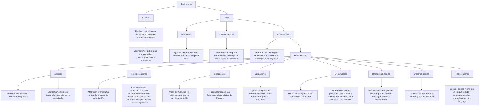

# Trabajos-Parseo

### TP1: Mapa conceptual

### TP2: Lenguaje a crear 

#### Objetivo
El lenguaje a desarrollar es un lenguaje de proposito general, mayormente pensado para el uso didactico, con soporte de enteros y booleanos. Ofrece estructuras de control de tipo condicional y bucle, además de permitir la definición y asignación de variables.
#### Alcance
Pensado para demostrar conceptos de gramatica y semantica, no esoterico y no de producción.

El lenguaje esta creado para ofrecer las características de un lenguaje imprerativo, con tipado estático. No soporta recusión ni concurrencia.

#### Especificaciones léxicas
##### Palabras reservadas

Palabra |  Significado
--------|-------
INICIO:| Indica el inicio de un programa
FIN | Indica el fin de un programa
SALIDA:| Imprime una expresion númerica o booleana.
SI: | Inicia una estructura condicional (If)
ENTONCES:| Indica el inicio del bloque a ejecutar si la condición es VERDADERA
SINO:| Indica el bloque a ejecutar si la condición es FALSA
MIENTRAS:| Define la condición a cumplir para ejecutar un bucle (While)
HACER: | Indica el bloque de sentencias a ejecutar si la condición del bucle es verdadera
VAR | Inicia la declaración de una variable
ENTERO | Indica que el tipo de dato de la variable declarada es entero
BOOLEANO | Indica que el tipo de dato de la variable declarada es booleano

##### Identificadores

Los identificadores minimamente estan compuestos por una letra en minúscula (a-z) y pueden ser sucedidos por otra letra, un numero (0 - 9) o un guion bajo o medio (_/-). No pueden tener mayúsculas.

##### Operadores
|Tipo | Operador |
|-----|----------|
| Aritmetico | "+", "-", "/", "*", "%" |
| Logico | "&", "\|" |
| Comparación | "==", "!=", ">", "<" | 
| Asignación | "=" |
| Negación | "!" | 
| Fin de sentencia | ";" |
##### Tipos de datos 
| Tipo | Valores |
------------------|--------------
| Booleano | "VERDADERO", "FALSO" |
|Entero | (0-9)+ |

#### Especificaciones sintácticas
[Notación BNF del lenguaje](notacion_bnf.md)

Regla | Especificación
-------------|------------
Estructura del programa | El programa siempre empieza con la palabra INICIO, seguida por un bloque de sentencias y finaliza con FIN.
Bloque | Está compuesto por cero o más sentencias
Sentencia | Puede ser la declaracion o asignación de una variable, una estructura condicional, un bucle o una salida por pantalla. Todas, menos las sentencias condicionales y los bucles, deben terminar con ";".
Declaración | Inicializa una variable iniciando con la palabra VAR y luego indicando su tipo, su identificador y su valor inicial.
Asignación | Asigna un valor a una variable ya declarada, indicando su identificador seguido por "=" y su nuevo valor.
Salida | Imprime una expresion númerica o booleana.
Condicional | Estructura de control que selecciona un bloque dependiendo de una expresión booleana
Bucle | Ejecuta un bloque en caso de que una condición sea verdadera
Expresión | Operaciones o identificadores que reprensentan o producen valores numericos o booleanos.

#### Especificaciones semánticas

- **Declaraciones**: Cada variable debe ser declarada una única vez. Las variables definidas dentro del programa son de ámbito local, mientras que las definidas dentro de las estructuras condicionales o de bucle corresponden a un subambito y por lo tanto solamente pueden ser usadas dentro de esa estructura.
- **Asignaciones**: Deben realizarse sobre una variable existente con un identificador válido. El valor asignado tiene que ser del mismo tipo que la variable.
- **Operaciones**: todas las operaciones aritméticas o booleanas son realizadas con notación prefija, de forma que el operador precede a los operandos. 
     - **Aritméticas**: "+", "-", "*", "/", "%" → solo entre enteros.
     - **Comparaciones**: "==", "!=", ">", "<" → ">" y "<" solo entre enteros.
     - **Booleanas**: "&", "|", "!" solamente sobre valores booleanos.

- **Condicional**: las condiciones deben ser expresiones booleanas válidas. Todas las variables definidas previamente pueden ser usadas dentro del bloque de sentencias, mientras que las definidas dentro del bloque solamente pueden usarse dentro del mismo.
- **Bucle**: las condiciones deben ser expresiones booleanas válidas. Todas las variables definidas previamente pueden ser usadas dentro del bloque de sentencias, mientras que las definidas dentro del bloque solamente pueden usarse dentro del mismo.
- **Salida**: Solamente imprime expresiones válidas bien tipadas.
- **Errores**: en caso de no respetarse las especificaciones correspondietnes a cada caso, se debe lanzar un mensaje de error dando detalle para cada uno.
